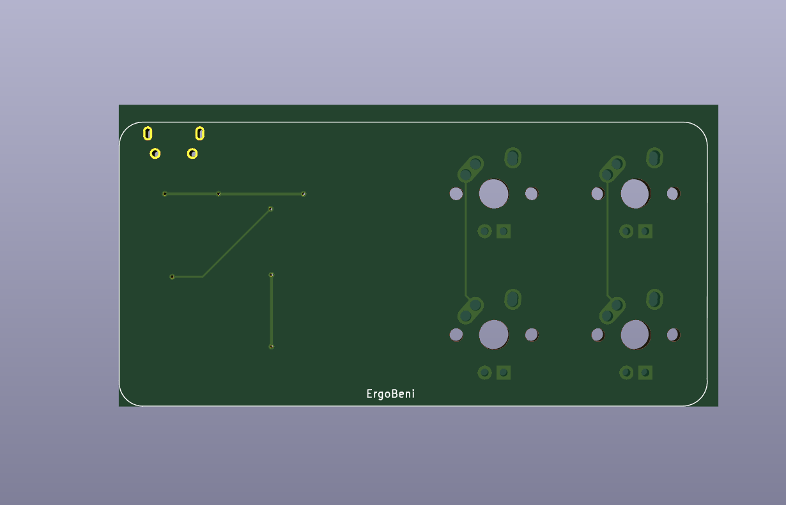
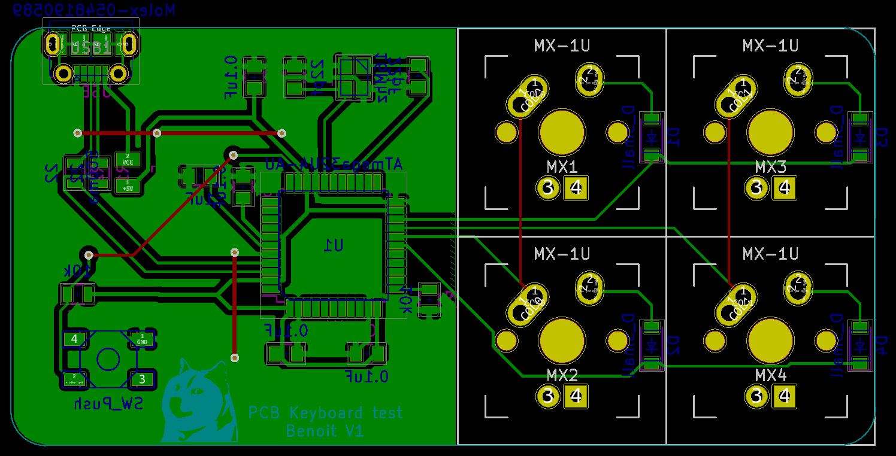
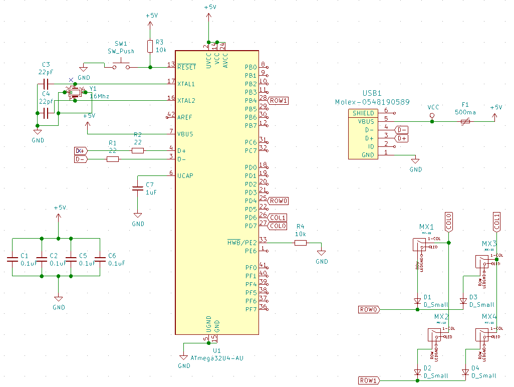
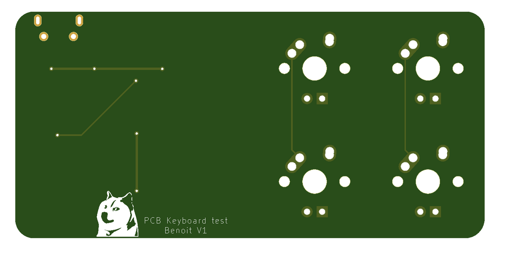
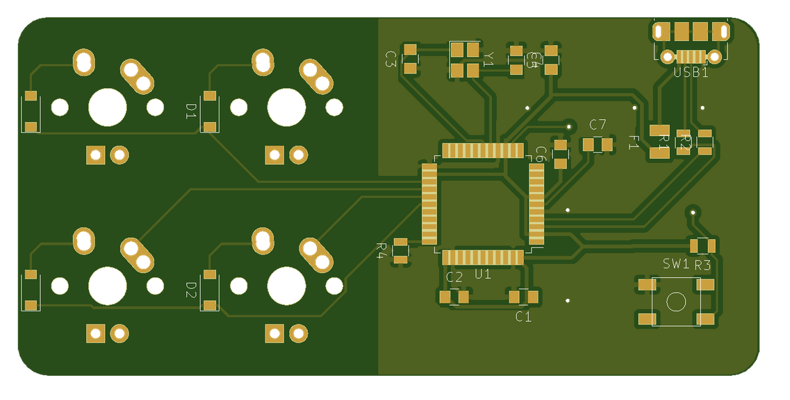

# ai03_tutorial

⚠️ This is a prototype that has not been builded for the moment. I am waiting for review ⚠️

Thanks ai03 and Ruiqi Mao for this very good guide (baby steps, shortcuts, many screenshots, electronic tips...).

## Feedbacks for [the original guide](https://kbwiki.ai03.me/books/pcb-design)

### [Part 4](https://kbwiki.ai03.me/books/pcb-design/page/pcb-guide-part-4---the-rest-of-the-schematic)
* Hard to find all schema. I had to import one by one lib from https://github.com/ldoiron17/Kicad_Libraries
* Different menu: "Switch to inch instead of mm on the left pane, and open Setup -> Design Rules." is Board Setup -> Design Rules -> Net classes
* Different menu: "Then click on the first corner of the zone to surround to bring up a menu." the "Copper Zone Properties" is different
### [Part 6](https://kbwiki.ai03.me/books/pcb-design/page/pcb-guide-part-6---fill-zones-decoration-and-production)
* Copper Zone Properties doesn't offer "Boundary mode" anymore
* When I try to simulate the board it's not delimited by the line 
* When I run the DRC the Molex connector have unclosed path so I need to switch
* DRC told be that "Driled holes too close together" for MX-1U

## Result

### PCB from Kicad

### Schema from Kicad

### Gerber file front and back from JLPCB

